<div align="center">


<br/>


**Screen 100 resumes in minutes — not hours — with grounded, auditable, AI-powered candidate rankings.**

</div>

---

## 📋 Contents

[The Problem](#-the-problem) · [The Solution](#-the-solution) · [Core Flow](#-core-processing-flow) · [See It In Action](#-see-it-in-action) · [Two Portals](#-two-portals-one-app) · [AI Agents](#-the-ai-agents) · [RAG](#-how-rag-keeps-it-trustworthy) · [End-to-End](#-end-to-end-flow) · [Auth & Persistence](#-security--persistence) · [Clean Architecture](#-clean-architecture) · [Tech Stack](#-technology-stack) · [Getting Started](#-getting-started) · [Tests](#-tests)

---

## 🔴 The Problem

> Recruiters spend **hours** manually screening resumes and comparing candidates against job requirements. The process is **slow, inconsistent, and hard to scale** — especially when a single role attracts hundreds of applicants.

| Today's reality | Cost to the business |
|---|---|
| Manual resume screening | Hours of recruiter time per role |
| Subjective, human-to-human comparison | Inconsistent shortlisting decisions |
| No structured skill-gap view | Weaker candidate–job alignment |
| Doesn't scale with volume | Slower hiring cycles, missed talent |

---

## 🟢 The Solution

**An AI-powered talent-acquisition platform that reads resumes, matches them to a job, scores and ranks candidates, drafts interview questions, and explains every recommendation — with a human still in control.**

Recruiters upload a job description and a batch of resumes. Behind the scenes, a team of specialized **AI agents**, coordinated by **Semantic Kernel** and grounded in the organization's own hiring knowledge via **Retrieval-Augmented Generation (RAG)**, does the heavy lifting and returns a ranked, defensible shortlist.

---

## 🎞 Core Processing Flow

<div align="center">


</div>

| Capability | What the recruiter gets |
|---|---|
| 📄 **Resume parsing** | Skills, experience, education & certifications extracted automatically |
| 🎯 **Semantic matching** | Each candidate scored against the job description |
| 📊 **Skill-gap analysis** | A clear view of what each candidate is missing |
| 🏆 **Candidate ranking** | A prioritized, ready-to-review shortlist |
| ❓ **Interview questions** | Role-specific technical, behavioral & situational questions |
| 🧾 **Explainable output** | Supporting reasoning and citations for every recommendation |
| 🔒 **Full audit trail** | Every AI action and recruiter decision is logged & persisted |

---

## 📸 See It In Action

<div align="center">

| Recruiter Dashboard | Candidate Ranking |
|:---:|:---:|
| 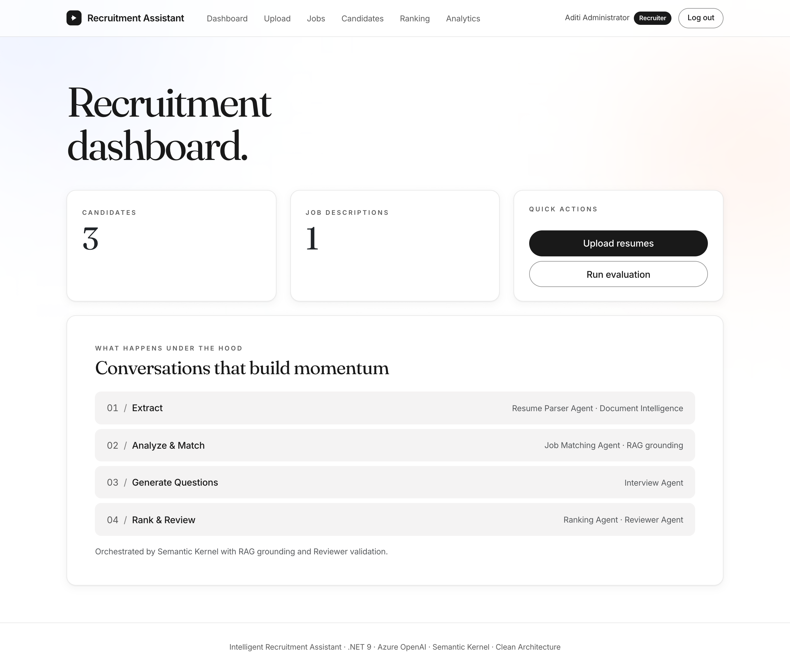 | 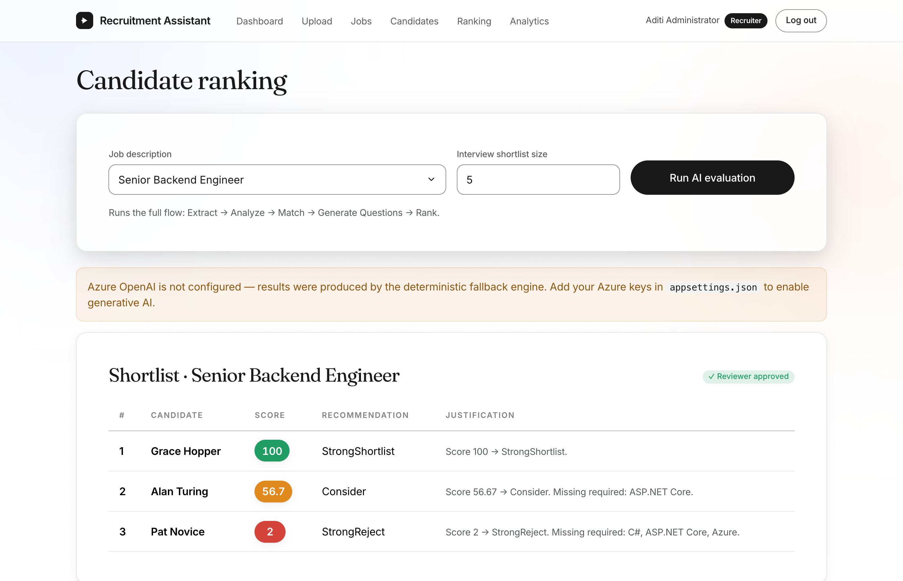 |
| **Job Descriptions** | **Candidates** |
| 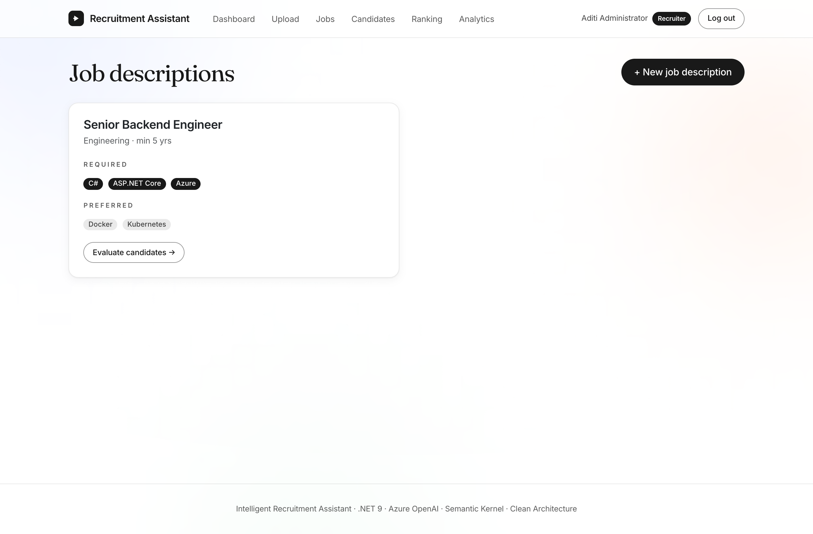 | 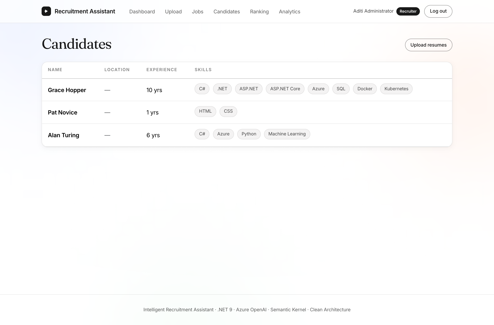 |
| **Resume Upload** | **Analytics & Audit Trail** |
| 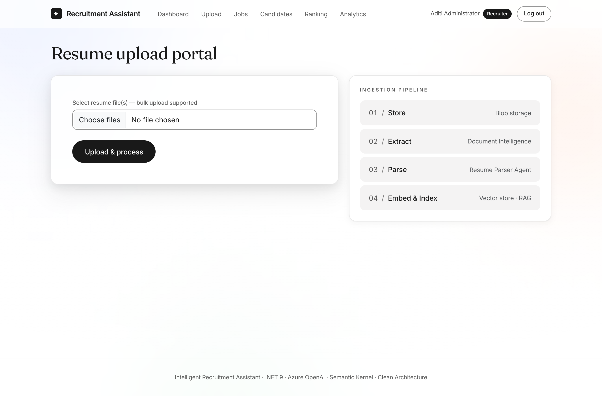 | 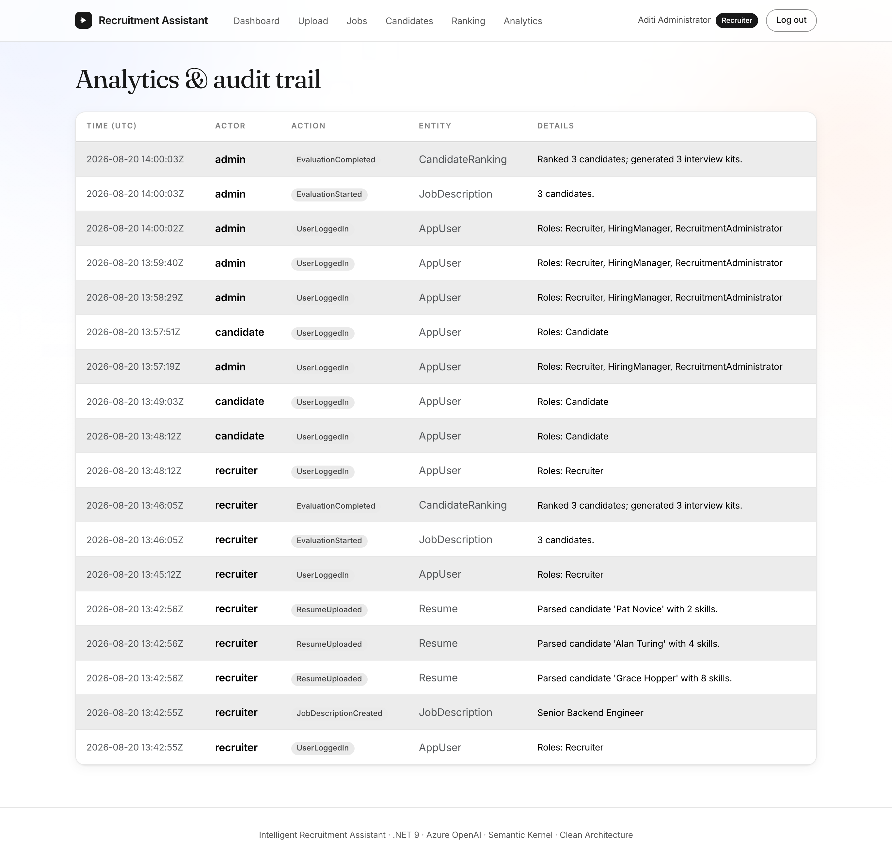 |

</div>

---

## 🚪 Two Portals, One App

The MVC frontend serves **two role-based experiences** behind a single JWT login:

<div align="center">

| 🧑‍💼 Recruiter Portal | 👤 Candidate Portal |
|:---:|:---:|
| Dashboard · Jobs · Candidates · Ranking · Analytics | My profile · Upload resume · Browse open roles |
| 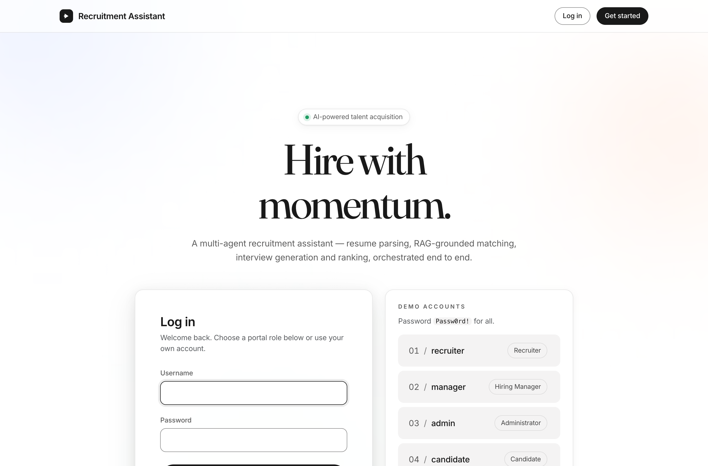 | 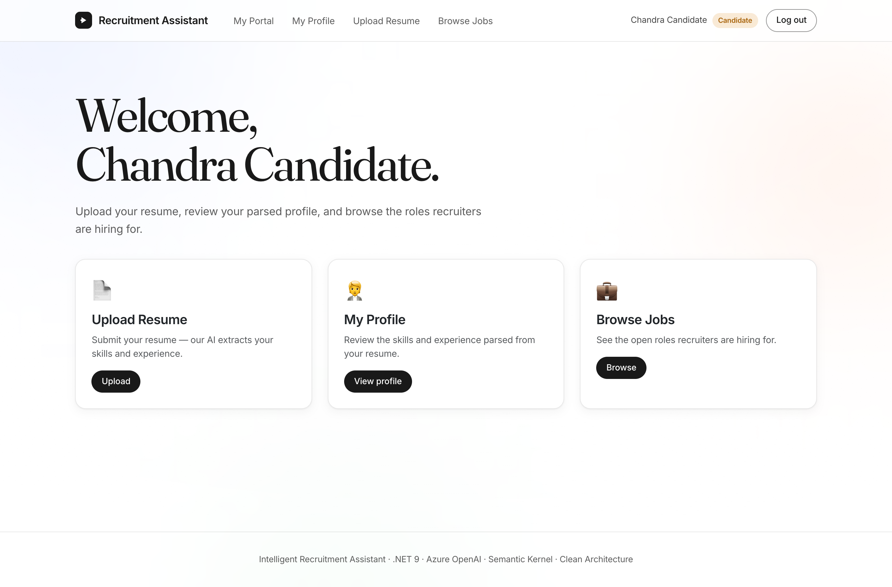 |
| **Recruiters, Hiring Managers & Admins** run the full evaluation pipeline | **Candidates** register, upload a resume, and track their parsed profile |
| 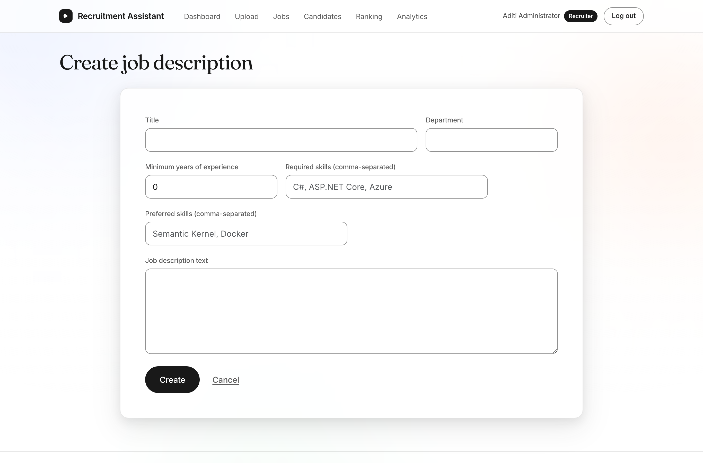 | 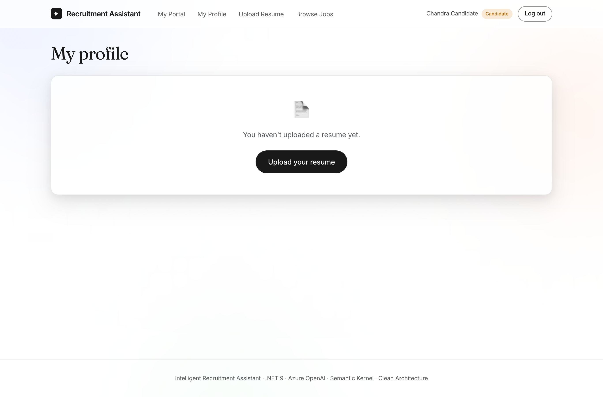 |

</div>

> Roles: **Recruiter · Hiring Manager · Recruitment Administrator · Candidate.** Authorization is enforced at the API (policies) and the UI (role-based navigation). Admins additionally see the Analytics / audit trail.

---

## 🕹 The AI Agents

Rather than one giant prompt, the solution uses **five specialized agents**, each with a narrow job, coordinated by Semantic Kernel. This makes the system easier to reason about, test, and trust.


| Agent | Responsibility |
|---|---|
| 📄 **Resume Parser** | Extracts and structures candidate information from raw resumes |
| 🎯 **Job Matching** | Compares candidates to the JD, computes fit scores, identifies skill gaps |
| ❓ **Interview** | Generates role-specific interview questions and evaluation criteria |
| 🏆 **Ranking** | Produces the final ranked shortlist with recommendation scores |
| ✅ **Reviewer** | Validates AI output for fairness and consistency **before** it reaches the recruiter |

---

## 🔎 How RAG Keeps It Trustworthy

The assistant doesn't rely on the language model's memory alone. Every evaluation is **grounded** in the organization's own job descriptions, competency frameworks, and hiring policies using **Retrieval-Augmented Generation**.

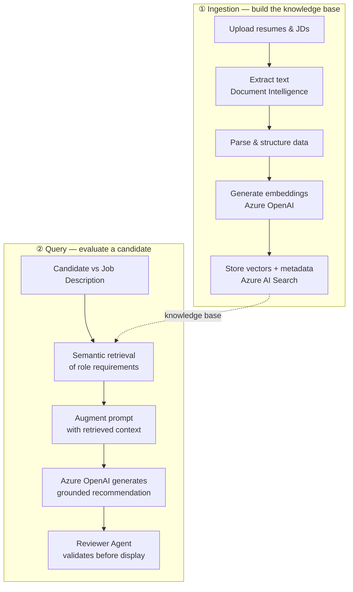

**Why this matters:** recommendations stay anchored to *approved hiring criteria*, not model guesswork — meaning **better alignment, less hallucination, and traceable, defensible decisions**.

---

## 🔄 End-to-End Flow

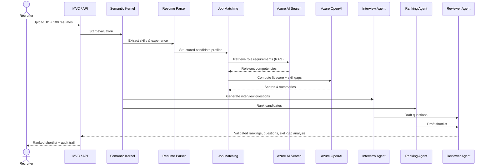

---

## 🔐 Security & Persistence

| Concern | How it's handled |
|---|---|
| **Authentication** | Self-issued **JWT** bearer tokens with a username/password login (`/api/auth/login`, `/api/auth/register`); Microsoft **Entra ID** supported when configured |
| **Authorization** | Role-based policies (`Recruiters`, `Administrators`, `CandidatePortal`) on every API endpoint; role-aware navigation in the UI |
| **Password safety** | Salted **PBKDF2-SHA256** hashing — plaintext passwords are never stored |
| **Durable storage** | **Azure Cosmos DB (NoSQL)** persists candidates, resumes, jobs, evaluations, rankings, interview kits, the audit trail **and user accounts** — data survives API restarts |
| **Auditability** | Every recruiter action, evaluation and AI activity is logged and queryable |
| **Resilience** | Every Azure integration has a deterministic **offline fallback** (in-memory store, hash embeddings, plain-text extractor) so the app runs with zero keys |
| **Secrets** | Real keys live in a gitignored `appsettings.*.Local.json` overlay or Azure **Key Vault** — never in source control |

> 🗄 **Cosmos DB design:** one database, eight containers sharing a single 400 RU/s throughput pool (fits the free tier). When Cosmos isn't configured the app transparently falls back to an in-memory store — verified by round-trip mapping tests.

---

## 🧱 Clean Architecture

Business logic sits at the center and knows nothing about Azure. Cloud services are plug-in adapters, keeping the system **testable, maintainable, and vendor-swappable**.

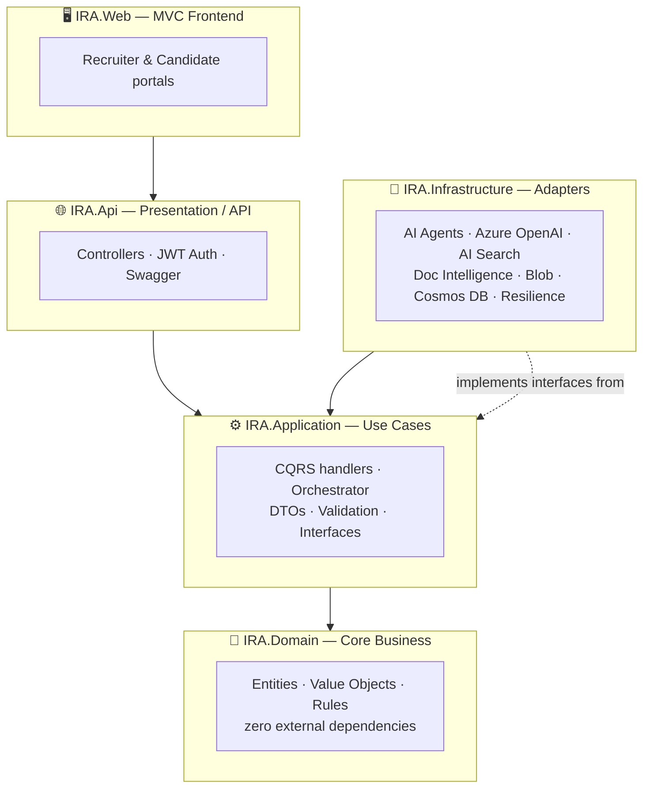

**The dependency rule:** everything points *inward* toward the domain. `IRA.Domain` has no dependency on Azure SDKs or any framework — so the core hiring logic can be unit-tested in isolation and the AI providers can be replaced without touching business rules.

---

## 🧰 Technology Stack

| Tool / Service | Purpose |
|---|---|
| **ASP.NET Core MVC (.NET 9)** | Front-end UI — recruiter & candidate portals |
| **ASP.NET Core Web API (.NET 9)** | Backend service layer |
| **Azure OpenAI** *(GPT-4o / GPT-4.1)* | Candidate analysis & response generation |
| **Azure OpenAI Embeddings** | Vector embedding generation |
| **Azure AI Search** | Semantic search & vector database |
| **Azure Document Intelligence** | Resume extraction |
| **Semantic Kernel** | AI orchestration & agent framework |
| **Azure Cosmos DB (NoSQL)** | Durable persistence across restarts |
| **Azure Blob Storage** | Resume & JD storage |
| **JWT / Microsoft Entra ID** | Authentication & authorization |
| **Azure Key Vault** | Secret management |
| **Application Insights** | Monitoring & observability |
| **xUnit** | Automated testing — 43 tests |

---

## 🚀 Getting Started

**Prerequisites:** .NET SDK 9. No Azure keys required — the app runs on offline fallbacks out of the box.

```bash
# 1. Build
dotnet build IntelligentRecruitmentAssistant.slnx

# 2. Run the API (backend)   → http://localhost:5180  (Swagger at /swagger)
dotnet run --project src/IRA.Api

# 3. Run the MVC frontend    → http://localhost:5280
dotnet run --project src/IRA.Web
```

Open **http://localhost:5280** and sign in with a demo account (password `Passw0rd!`):

| Username | Role |
|---|---|
| `recruiter` | Recruiter |
| `manager` | Hiring Manager |
| `admin` | Administrator (+ Analytics) |
| `candidate` | Candidate portal |

> Candidates can also self-register. To enable live Azure services (incl. Cosmos DB persistence), fill in `src/IRA.Api/appsettings.Development.Local.json` — any section left blank uses the offline fallback.

<div align="center">
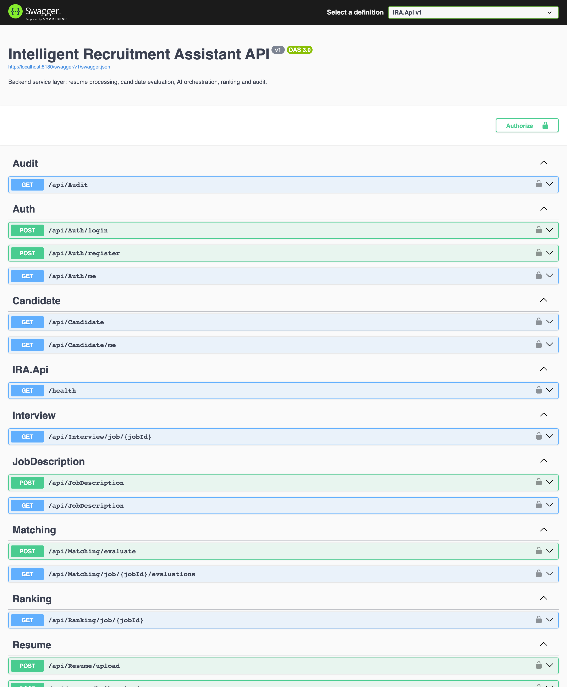
</div>

---

## 🧪 Tests

```bash
dotnet test IntelligentRecruitmentAssistant.slnx
```

**43 tests pass** with no Azure configuration:

| Test type | Location |
|---|---|
| Unit / domain rules | `tests/IRA.UnitTests/DomainRulesTests.cs` |
| Resume parsing | `tests/IRA.UnitTests/ResumeParsingTests.cs` |
| Candidate matching | `tests/IRA.UnitTests/CandidateMatchingTests.cs` |
| RAG retrieval | `tests/IRA.UnitTests/RagRetrievalTests.cs` |
| AI agent workflow | `tests/IRA.UnitTests/AgentWorkflowTests.cs` |
| Interview generation | `tests/IRA.UnitTests/InterviewQuestionGenerationTests.cs` |
| Cosmos mapping round-trip | `tests/IRA.UnitTests/CosmosMappingTests.cs` |
| JWT authentication | `tests/IRA.IntegrationTests/JwtAuthenticationTests.cs` |
| Authorization (401/403/200) | `tests/IRA.IntegrationTests/AuthorizationTests.cs` |
| Integration (end-to-end) | `tests/IRA.IntegrationTests/RecruitmentFlowIntegrationTests.cs` |

---

## 📂 Project Structure

```
Intelligent_Recruitment_Assistant/
├── Directory.Build.props
└── src/
    ├── IRA.Domain/            💎 Core business — entities, value objects, rules (no dependencies)
    ├── IRA.Application/       ⚙️ Use cases — CQRS, orchestrator, DTOs, validation, interfaces
    ├── IRA.Infrastructure/    🔌 Adapters — AI agents, Azure OpenAI, AI Search, Doc Intelligence,
    │                             Cosmos DB, Blob storage, audit, resilience
    ├── IRA.Api/               🌐 ASP.NET Core Web API (.NET 9) — controllers, JWT auth, Swagger
    └── IRA.Web/               🖥 ASP.NET Core MVC — recruiter & candidate portals
```

---

<div align="center">

### Intelligent Recruitment Assistant
**AI-powered candidate screening, matching, interview preparation & ranking**

*Powered by .NET 9 · Azure OpenAI · Semantic Kernel · Cosmos DB · Clean Architecture*

</div>
