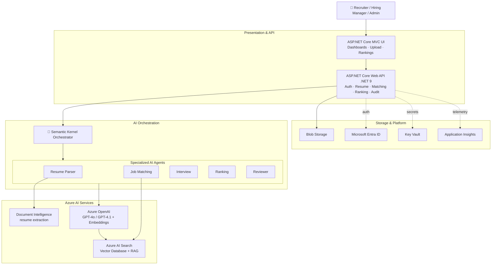
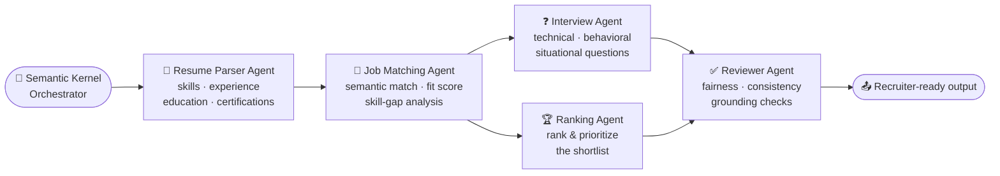
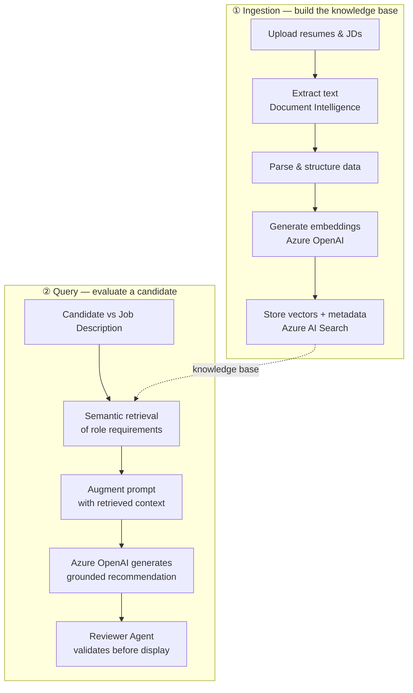
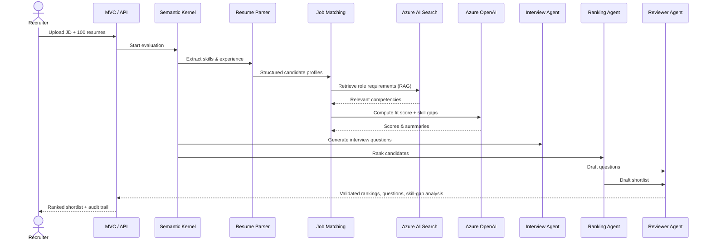
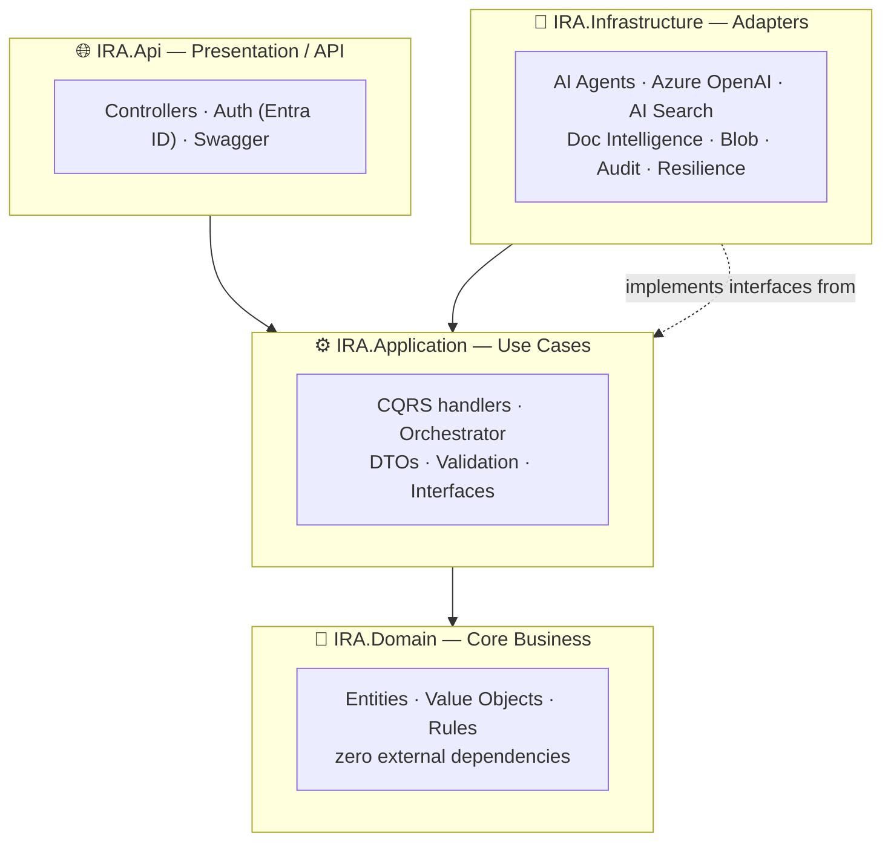

<div align="center">

# 🤖 Intelligent Recruitment Assistant

### An AI-enabled .NET 9 application using Azure OpenAI, Semantic Kernel & Clean Architecture

*Screen 100 resumes in minutes — not hours — with grounded, auditable, AI-powered candidate rankings.*

`ASP.NET Core 9` · `Azure OpenAI` · `Semantic Kernel` · `Azure AI Search (RAG)` · `Clean Architecture`

</div>

---

## 📋 Agenda

1. [The Problem](#-the-problem)
2. [The Solution](#-the-solution-in-one-line)
3. [What It Does](#-what-it-does)
4. [Why It Matters (Business Value)](#-why-it-matters)
5. [Solution Architecture](#-solution-architecture)
6. [The AI Agents](#-the-ai-agents)
7. [How RAG Keeps It Trustworthy](#-how-rag-keeps-it-trustworthy)
8. [End-to-End Flow](#-end-to-end-flow)
9. [Clean Architecture](#-clean-architecture)
10. [Technology Stack](#-technology-stack)
11. [A Real Example](#-a-real-example)
12. [Trust, Safety & Governance](#-trust-safety--governance)
13. [Expected Impact](#-expected-impact)
14. [Project Structure](#-project-structure)

---

## 🔴 The Problem

> Recruiters spend **hours** manually screening resumes and comparing candidates against job requirements. The process is **slow, inconsistent, and hard to scale** — especially when a single role attracts hundreds of applicants.

| Today's reality | Cost to the business |
|---|---|
| Manual resume screening | Hours of recruiter time per role |
| Subjective, human-to-human comparison | Inconsistent shortlisting decisions |
| No structured skill-gap view | Weaker candidate–job alignment |
| Doesn't scale with volume | Slower hiring cycles, missed talent |

---

## 🟢 The Solution — in one line

**An AI-powered talent-acquisition platform that reads resumes, matches them to a job, scores and ranks candidates, drafts interview questions, and explains every recommendation — with a human still in control.**

Recruiters upload a job description and a batch of resumes. Behind the scenes, a team of specialized **AI agents**, coordinated by **Semantic Kernel** and grounded in the organization's own hiring knowledge via **Retrieval-Augmented Generation (RAG)**, does the heavy lifting and returns a ranked, defensible shortlist.

---

## ⚡ What It Does

The system takes recruitment inputs and runs them through a consistent, five-stage pipeline:

```
  Extract  →  Analyze  →  Match  →  Generate Questions  →  Rank
```

| Capability | What the recruiter gets |
|---|---|
| 📄 **Resume parsing** | Skills, experience, education & certifications extracted automatically |
| 🎯 **Semantic matching** | Each candidate scored against the job description |
| 📊 **Skill-gap analysis** | A clear view of what each candidate is missing |
| 🏆 **Candidate ranking** | A prioritized, ready-to-review shortlist |
| ❓ **Interview questions** | Role-specific technical, behavioral & situational questions |
| 🧾 **Explainable output** | Supporting reasoning and citations for every recommendation |
| 🔒 **Full audit trail** | Every AI action and recruiter decision is logged |

**Primary users:** Recruiters · Hiring Managers · Recruitment Administrators

---

## 💼 Why It Matters

<div align="center">

| Business objective | How the assistant delivers it |
|---|---|
| **Reduce screening time** | Automates resume parsing & first-pass evaluation |
| **Improve shortlist quality** | Consistent, criteria-based scoring for every candidate |
| **Accelerate hiring** | Turns hours of manual review into minutes |
| **Better candidate–job fit** | Semantic matching + skill-gap analysis |
| **Defensible decisions** | Grounded recommendations with citations & audit logs |
| **Modernize the stack** | Practical, production-ready adoption of Azure OpenAI |

</div>

> **Success measure:** *Faster hiring, improved candidate quality, and reduced screening effort.*

---

## 🏗 Solution Architecture

A layered, cloud-native design: an MVC/API front door, a Semantic Kernel orchestration brain, a team of AI agents, and Azure AI services underneath.



---

## 🕹 The AI Agents

Rather than one giant prompt, the solution uses **five specialized agents**, each with a narrow job, coordinated by Semantic Kernel. This makes the system easier to reason about, test, and trust.



| Agent | Responsibility |
|---|---|
| 📄 **Resume Parser** | Extracts and structures candidate information from raw resumes |
| 🎯 **Job Matching** | Compares candidates to the JD, computes fit scores, identifies skill gaps |
| ❓ **Interview** | Generates role-specific interview questions and evaluation criteria |
| 🏆 **Ranking** | Produces the final ranked shortlist with recommendation scores |
| ✅ **Reviewer** | Validates AI output for fairness and consistency **before** it reaches the recruiter |

---

## 🔎 How RAG Keeps It Trustworthy

The assistant doesn't rely on the language model's memory alone. Every evaluation is **grounded** in the organization's own job descriptions, competency frameworks, and hiring policies using **Retrieval-Augmented Generation**.



**Why this matters to the business:** recommendations stay anchored to *approved hiring criteria*, not model guesswork — which means **better alignment, less hallucination, and traceable, defensible decisions**.

---

## 🔄 End-to-End Flow

What actually happens when a recruiter drops in a job and a stack of resumes:



---

## 🧱 Clean Architecture

The codebase follows **Clean Architecture** — business logic sits at the center and knows nothing about Azure. Cloud services are plug-in adapters, which keeps the system **testable, maintainable, and vendor-swappable**.



**The dependency rule:** everything points *inward* toward the domain. `IRA.Domain` has no dependency on Azure SDKs or any framework — so the core hiring logic can be unit-tested in isolation and the AI providers can be replaced without touching business rules.

| Layer | Contains |
|---|---|
| **Domain** | Candidate, Resume, JobDescription, Skill, Evaluation & Ranking entities; FitScore, SkillGap, Citation value objects; matching & recommendation rules |
| **Application** | CQRS commands/queries, the recruitment orchestrator, DTOs, FluentValidation, and all service interfaces |
| **Infrastructure** | The five AI agents, Azure OpenAI, Azure AI Search, Document Intelligence, Blob Storage, audit logging, retry/resilience |
| **API** | ASP.NET Core Web API (.NET 9) controllers, Entra ID authentication, Swagger |

---

## 🧰 Technology Stack

| Tool / Service | Purpose |
|---|---|
| **ASP.NET Core MVC (.NET 9)** | Front-end user interface |
| **ASP.NET Core Web API (.NET 9)** | Backend service layer |
| **Azure OpenAI** *(GPT-4o / GPT-4.1)* | Candidate analysis & response generation |
| **Azure OpenAI Embeddings** | Vector embedding generation |
| **Azure AI Search** | Semantic search & vector database |
| **Azure Document Intelligence** | Resume extraction |
| **Semantic Kernel** | AI orchestration & agent framework |
| **Azure AI Foundry** | Model governance |
| **Azure Blob Storage** | Resume & JD storage |
| **Microsoft Entra ID** | Authentication & authorization |
| **Azure Key Vault** | Secret management |
| **Application Insights** | Monitoring & observability |
| **xUnit** | Automated testing |

---

## 🎬 A Real Example

> **Scenario:** A recruiter uploads a **Software Developer** job description and **100 candidate resumes.**

**The system:**

1. Ingests resumes through the application and extracts skills & experience *(Resume Parser Agent)*
2. Compares each profile against the JD *(Job Matching Agent)*
3. Retrieves the relevant competency requirements *(Azure AI Search / RAG)*
4. Orchestrates the evaluation *(Semantic Kernel)*
5. Generates candidate summaries *(Azure OpenAI)*
6. Drafts interview questions *(Interview Agent)*
7. Validates the results *(Reviewer Agent)*
8. Produces the final shortlist *(Ranking Agent)*

**The recruiter receives:**

✅ Candidate summaries generated &nbsp;·&nbsp; ✅ Skill-gap analysis &nbsp;·&nbsp; ✅ Ranked shortlist &nbsp;·&nbsp; ✅ Interview questions &nbsp;·&nbsp; ✅ Recommendations &nbsp;·&nbsp; ✅ Full evaluation audit trail

---

## 🛡 Trust, Safety & Governance

Built for an environment where hiring decisions must be **fair, explainable, and auditable.**

| Concern | How it's handled |
|---|---|
| **Explainability** | Every recommendation ships with supporting reasoning and citations |
| **Human oversight** | The Reviewer Agent validates output *before* the recruiter sees it |
| **Grounding** | RAG keeps recommendations tied to approved job criteria |
| **Security** | Microsoft Entra ID authentication & role-based authorization |
| **Auditability** | Recruiter actions, evaluations, and AI activity are all logged |
| **Resilience** | Fallback mechanisms keep the system usable during AI-service disruptions |
| **Observability** | Application Insights monitoring across the platform |

---

## 📈 Expected Impact

<div align="center">

| ⏱ Faster | 🎯 Better | 🔍 Defensible |
|:---:|:---:|:---:|
| Hours of screening → minutes | Consistent, criteria-based shortlists | Grounded, cited, fully audited |

</div>

**Acceptance criteria met:** accurate resume parsing · correct semantic matching · relevant AI-generated interview questions · validated recommendations · accurate rankings · all actions auditable · recommendations grounded in approved hiring criteria.

---

## 📂 Project Structure

```
Intelligent_Recruitment_Assistant/
├── Directory.Build.props
└── src/
    ├── IRA.Domain/            💎 Core business — entities, value objects, rules (no dependencies)
    ├── IRA.Application/       ⚙️ Use cases — CQRS, orchestrator, DTOs, validation, interfaces
    ├── IRA.Infrastructure/    🔌 Adapters — AI agents, Azure OpenAI, AI Search, Doc Intelligence,
    │                             Blob storage, audit, resilience
    └── IRA.Api/               🌐 ASP.NET Core Web API (.NET 9) — controllers, Entra ID auth, Swagger
```

> **Note on design:** the solution ships with both cloud adapters (Azure OpenAI, Azure AI Search, Blob Storage) and lightweight local fallbacks (deterministic embeddings, in-memory vector store & repository, local file storage) — so the platform can run and be demonstrated end-to-end even without live Azure credentials.

---

<div align="center">

### Intelligent Recruitment Assistant
**AI-powered candidate screening, matching, interview preparation & ranking**

*Powered by .NET 9 · Azure OpenAI · Semantic Kernel · Clean Architecture*

</div>
